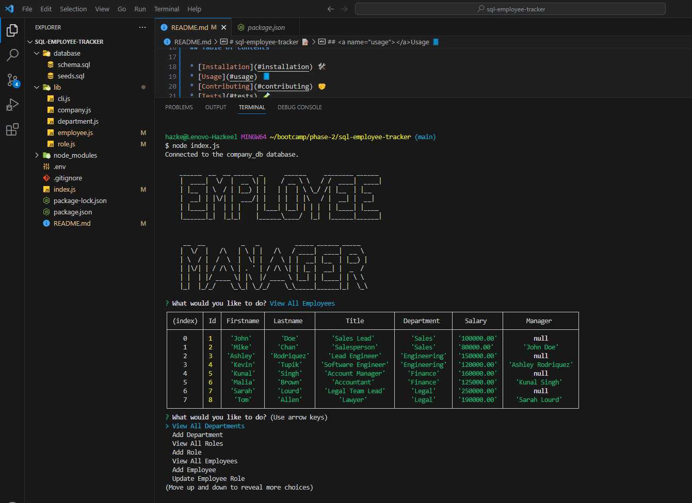

# sql-employee-tracker 📝


## Description 📄

An employee tracker app with Node.js, leveraging the power of Inquirer, MySQL2, and Dotenv dependencies. This sophisticated application is designed to enable intuitive data interaction through a user-friendly interface.

Through Inquirer-powered prompts, users can intuitively create, read, update, and delete records within these tables. 

The MySQL2 library seamlessly bridges the gap between the app and the MySQL database, ensuring data integrity.

Dotenv is employed to securely manage sensitive configuration data, such as database credentials, away from the source code. This practice contributes to a more robust and secure architecture.

Built on modern ES6 concepts, the app employs smart coding practices to streamline processes. It effectively manages data across three interconnected tables: departments, employees, and roles. The integration of these components ensures both accurate data representation and efficient data manipulation.

## Table of Contents

* [Installation](#installation) 🛠️
* [Usage](#usage) 📘
* [Contributing](#contributing) 🤝
* [Tests](#tests) 🧪
* [License](#license) 📜
* [Credits](#credits) 🙏
* [Questions](#questions) ❓
* [Deployed Application](#link) 🚀

## <a name="installation"></a>Installation 🛠️

To install the necessary dependencies, run the following command:

```
npm i
npm install inquirer@8.2.4
npm install dotenv@8.2.0
npm install mysql2@2.2.5
```

## <a name="usage"></a>Usage 📘

- Install Visual Studio Code to run the application.
- Install the NodeJS library.
- Download MySQL to create a database.
- Install the inquirer dependency to ask questions in the terminal.
- Install mysql2 dependency to create a connection with the MySQL database.
- Install dotenv dependency to use environment variables and secure your database password.

Following is a video demonstrating how to run the application in the terminal. 🎥

[](https://drive.google.com/file/d/1_1BuaXizdWtK82mw7pH_hvq-EYYwkUdI/view?usp=sharing)

## <a name="contributing"></a>Contribution 🤝

Knowledgeable users can assist in identifying potential security vulnerabilities or best practices to enhance the app's security. Skilled users can contribute code changes to fix bugs, optimize performance, or implement new features. 

## <a name="tests"></a>Tests 🧪

To run tests, run the following command:

```
node index.js
```

## <a name="license"></a>License 📜

This project is licensed under The MIT License. Here is the link to the license to access more information for your reference: [https://opensource.org/licenses/MIT](https://opensource.org/licenses/MIT)

## <a name="credits"></a>Credits 🙏

I utilized the study material provided by the institution as a reference to complete my application.

Following are the documents I used to help me write code:

- [MySQL documentation on installing and starting MySQL](https://dev.mysql.com/doc/mysql-getting-started/en/#mysql-getting-started-installing)
- [MySQL documentation on executing SQL statements from a text file](https://dev.mysql.com/doc/refman/8.0/en/mysql-batch-commands.html)
- [MySQL documentation on creating and selecting a database](https://dev.mysql.com/doc/refman/8.0/en/creating-database.html)
- [MySQL documentation on SELECT](https://dev.mysql.com/doc/refman/8.0/en/select.html)
- [MySQL documentation on INSERT](https://dev.mysql.com/doc/refman/8.0/en/insert.html)
- [MySQL documentation on DROP DATABASE](https://dev.mysql.com/doc/refman/8.0/en/drop-database.html)
- [npm documentation on MySQL2](https://www.npmjs.com/package/mysql2#installation)
- [MySQL documentation on data types](https://dev.mysql.com/doc/refman/8.0/en/data-types.html)
- [MySQL Docs on Aggregate Functions](https://dev.mysql.com/doc/refman/8.0/en/aggregate-functions.html)
- [Inquirer package](https://www.npmjs.com/package/inquirer/v/8.2.4)
- [MySQL2 package](https://www.npmjs.com/package/mysql2)

## <a name="questions"></a>Questions ❓

If you have further questions, you are welcome to reach me through my email at hazkeel27@gmail.com.

You can view my projects by going through my GitHub profile at [https://github.com/hazkeel27](https://github.com/hazkeel27).

## <a name="link"></a>Deployed Application 🚀

